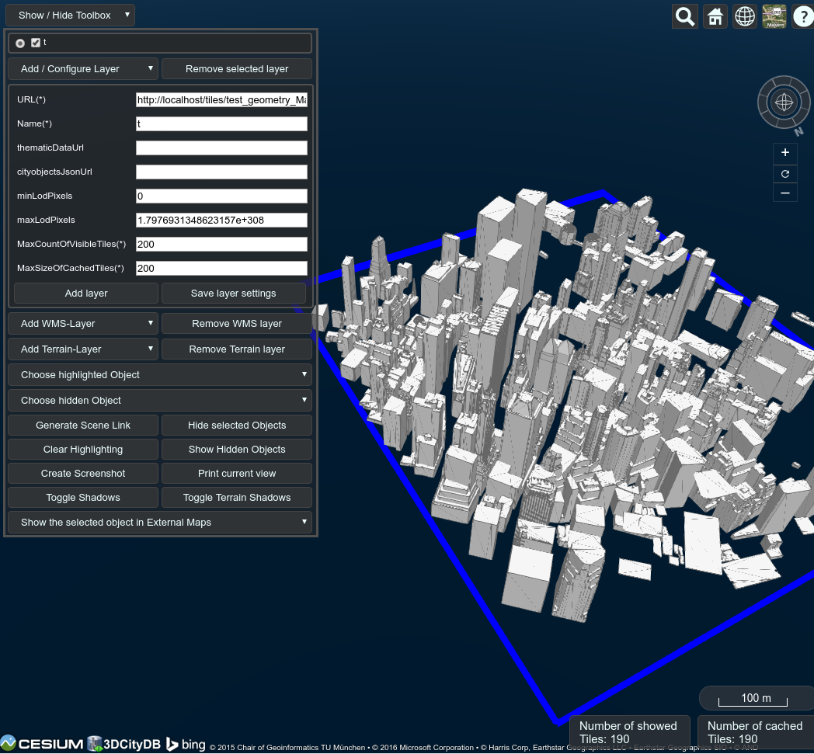

# osm2citygml
This tool will take XMLs of buildings from OSM using Overpass and convert it to CityGML format with FME for eventual use with 3DCityDB

To use on Ubuntu:

1. Install FME
2. Download OSM2World from http://osm2world.org/download/files/latest/OSM2World-latest-bin.zip, and extract.
3. Copy osm2citygml.fmw and osm2citygml.sh to the OSM2World-latest directory
4. Run "bash osm2citygml.sh test" where test is the name of the output gml. The default CityGML covers the financial district of New York (the bounding box in the Overpass query sets it).
5. You will have a test.gml file appear in the same directory which is the CityGML representation of that bounding box.
